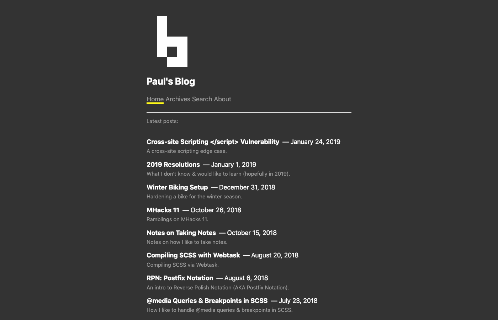
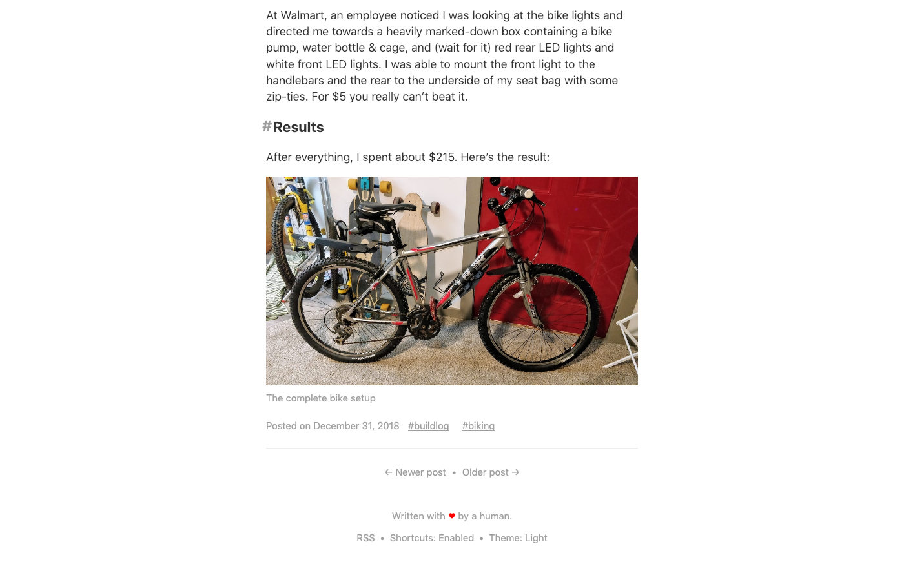
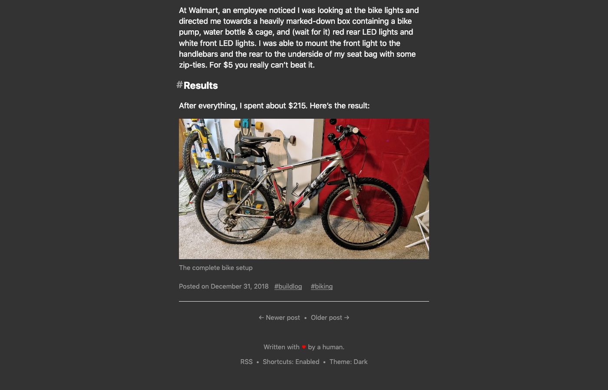

# [Blot][blot] Theme: Jot

This is my [personal theme][blog] for [Blot][blot]. It's a fork of the Index
theme.

## Features

- Light and dark theme(!!)
- Hash `id`s for each header
- `is-active` class for active menu links
- Normalized styling across browsers (removes horizontal scrollbar)

## Screenshots

## License

[Blot][blot], including the base Index theme, is licensed by
[David Merfield][david] under [CC0][cc0].

Modifications by myself, [Paul Esch-Laurent][me], are licensed under [MIT][mit].

[blog]: https://paul.af
[blot]: https://blot.im
[cc0]: https://github.com/davidmerfield/Blot/blob/master/LICENSE
[david]: https://github.com/davidmerfield
[me]: https://github.com/Pinjasaur
[mit]: https://pinjasaur.mit-license.org
